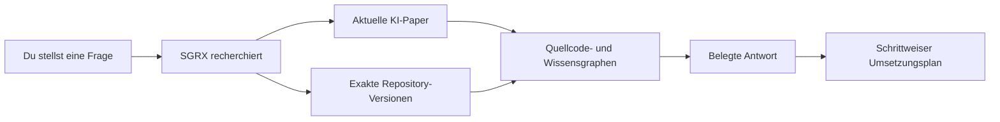

# SGRX

**Source Graph Research eXplorer**

[](https://github.com/alzenkastrati/sgrx/actions/workflows/ci.yml)
[](https://github.com/alzenkastrati/sgrx/actions/workflows/integration.yml)
[](LICENSE)

🌐 [English](README.md)

SGRX ist ein portabler Agent Skill und ein CLI-Workflow, der nicht an eine bestimmte Agenten-Umgebung gebunden ist. Es untersucht, **wie Software am besten gebaut werden sollte**, hilft beim Verständnis **bestehender Codebasen**, verfolgt Abhängigkeiten und erstellt belegte Umsetzungs- und Modernisierungspläne. Derselbe Skill funktioniert in kompatiblen KI-Agenten, Editor-Erweiterungen und internen Entwicklerwerkzeugen.

Stelle eine normale Frage. SGRX findet relevante KI-Paper und konkrete GitHub-Implementierungen, untersucht deren Quellcode und liefert einen praxisnahen Plan mit Belegen.

Aktuelle Version: **0.4.1**

## Was kann ich fragen?

```text
$sgrx Recherchiere den besten Ansatz für einen lokalen Sprachassistenten.
Vergleiche aktuelle Paper und reale GitHub-Projekte und erstelle anschließend
einen schrittweisen Implementierungsplan.
```

```text
$sgrx Zeige mir, wie die in diesem Projekt verwendete zod-Version
E-Mail-Adressen validiert. Verfolge unseren Aufruf bis in den genauen
Bibliotheksquellcode und erkläre, was dadurch kaputtgehen könnte.
```

### Beispiel: Eine Legacy-Codebasis schneller verstehen

Gib diesen Prompt einem KI-Assistenten, der mit der SGRX-CLI verbunden ist. Die verwendete Agenten-Umgebung spielt dabei keine Rolle:

```text
Nutze SGRX im Modus „standard“, um dieses Repository zu analysieren. Ziel ist,
dass ein neuer Entwickler die Codebasis schnell versteht.

Erstelle einen kurzen Markdown-Bericht mit:
1. den wichtigsten Modulen und ihrer Aufgabe;
2. den zentralen Abläufen von Einstiegspunkten bis zur Fachlogik;
3. wichtigen externen Abhängigkeiten und ihrer Verwendung;
4. kritischen oder schwer wartbaren Stellen; und
5. den drei sinnvollsten nächsten Schritten für Tests oder Modernisierung.

Belege jede Aussage mit Datei- und Zeilenangaben. Nimm keine Änderungen am
Code vor.
```

Damit lässt sich die Zeit zum Verständnis großer, über Jahre gewachsener Systeme deutlich verkürzen, bevor Änderungen vorgenommen werden.

## So funktioniert es



SGRX koordiniert drei Werkzeuge:

| Werkzeug | Einfache Aufgabe |
|---|---|
| **OpenSrc** | Beschafft die genaue Quellcode-Version. |
| **Graphify** | Bildet Architektur und Beziehungen ab. |
| **GitNexus** | Verfolgt Funktionen, Aufrufer, Abläufe und Änderungsrisiken. |

So müssen Entwickler und KI-Assistenten weniger aus Dokumentation erraten, arbeiten nicht versehentlich mit der falschen Version und geben weniger unnötigen Quellcode an das Modell weiter.

## Warum SGRX weniger Tokens verwenden kann

SGRX grenzt die relevanten Belege ein, **bevor** ein Modell sie liest:

- Es bewertet Paper und Repositories, statt jeden Kandidaten vollständig zu analysieren.
- Die Modi `quick` und `standard` erstellen reine Code-Snapshots.
- Graph-Abfragen liefern die relevanten Dateien, Funktionen und Beziehungen statt eines gesamten Repositories.
- Gespeicherte Indizes und Checkpoints vermeiden die Wiederholung bereits abgeschlossener Recherche.
- Ein Token-Budget begrenzt, wie viel Material in die semantische Analyse gelangt.

In einem SGRX-Selbsttest verwendete der ausgewählte Korpus nach der Filterung **5.499 Graphify-Eingabe-Tokens**. Das ist ein beobachtetes Beispiel, keine garantierte Einsparung und keine Messung des gesamten Modell- oder API-Verbrauchs. Die tatsächlichen Ergebnisse hängen von Frage, Repositories und Recherchemodus ab.

## Installation

SGRX folgt dem offenen Agent-Skills-Format: Jeder kompatible Client lädt dieselbe `skills/sgrx/SKILL.md` samt gebündelten Ressourcen. Die Datei `agents/openai.yaml` ergänzt ausschließlich Codex-UI-Metadaten; sie ist keine Zulassungsliste und wird von anderen Clients gefahrlos ignoriert.

Skill-Quelle: https://github.com/alzenkastrati/sgrx/tree/main/skills/sgrx

### Installation für alle unterstützten Agenten

Führe den portablen Installer in einem geklonten Checkout ohne `--target` aus. Dadurch werden alle Ziele installiert:

```console
# Windows
py -3 skills/sgrx/scripts/install_skill.py

# macOS und Linux
python3 skills/sgrx/scripts/install_skill.py
```

| Installationspfad | Agent-Clients |
|---|---|
| `~/.agents/skills/sgrx` | Cursor, GitHub Copilot, Gemini CLI, OpenCode, Windsurf, Amp |
| `~/.codex/skills/sgrx` | Codex |
| `~/.claude/skills/sgrx` | Claude Code |
| `~/.cline/skills/sgrx` | Cline |

Installiere nur ausgewählte Ziele, indem du `--target` mit `shared`, `codex`, `claude` oder `cline` wiederholst. Vorhandene Installationen werden aktualisiert, andere Skills bleiben unberührt.

### Direkte CLI-Nutzung

Agenten und Entwicklerwerkzeuge können die unabhängig nutzbare CLI auch direkt aufrufen. Verwende unter Windows `py -3`, damit der `python`-Alias des Microsoft Store den Befehl nicht abfängt:

```console
# Windows
py -3 skills/sgrx/scripts/sgrx.py doctor
py -3 skills/sgrx/scripts/sgrx.py --help

# macOS und Linux
python3 skills/sgrx/scripts/sgrx.py doctor
python3 skills/sgrx/scripts/sgrx.py --help
```

Binde die CLI in den bereits verwendeten Agenten- oder Entwicklerworkflow ein und verwende den Prompt oben als klaren Arbeitsauftrag.

### Praktiken aus einem anderen Repository prüfen

Verwende `audit`, wenn das andere Repository ein Benchmark oder Workflow-Katalog und keine Anwendungsabhängigkeit ist:

```console
py -3 skills/sgrx/scripts/sgrx.py audit --registry github --benchmark owner/workflow-catalog --ref 0123456789abcdef0123456789abcdef01234567 --project . --question "Welche Workflow- und Validierungspraktiken sollte dieses Projekt übernehmen?"
```

Der Audit-Modus hält Benchmark- und Consumer-Indizes getrennt, schließt Bilder und Medien standardmäßig aus und stoppt vor Graphify, wenn das Datei- oder Tokenbudget überschritten würde. Lifecycle, Kontext, Distribution, Validierung und Zuverlässigkeit werden getrennt abgefragt. Danach schreibt SGRX Belegzuordnungen, einen verifizierten Bericht, wiederverwendbare Checkpoints und ein kompaktes `RUN_MANIFEST.md` für die Übergabe.

Einen großen Benchmark kannst du ohne höheres Budget gezielt verkleinern. Wiederhole dafür `--include-path` oder `--exclude-path` mit Repository-relativen Dateien oder Verzeichnissen, zum Beispiel `--include-path reports --include-path development-workflows --exclude-path reports/archive`.

## Voraussetzungen

- Python 3.10+
- Node.js 24+
- Git
- OpenSrc 0.7.3+
- Graphify 0.9.12+
- GitNexus 1.6.5+

Installiere die drei Recherchewerkzeuge:

```console
npm install --global opensrc@0.7.3 gitnexus@1.6.5
# Windows
py -3 -m pip install graphifyy==0.9.12
# macOS und Linux
python3 -m pip install graphifyy==0.9.12
```

Prüfe anschließend, ob alles bereit ist:

```console
# Windows
py -3 skills/sgrx/scripts/sgrx.py doctor
# macOS und Linux
python3 skills/sgrx/scripts/sgrx.py doctor
```

## Was erhalte ich?

- Eine kurze Antwort auf die ursprüngliche Frage.
- Die Paper und Repository-Versionen, die tatsächlich untersucht wurden.
- Graphgestützte Verbindungen zwischen Architektur, Dateien und Funktionen.
- Einen detaillierten Umsetzungsplan in kleinen Arbeitspaketen.
- Klare Kennzeichnungen für Fakten, Schlussfolgerungen und offene Fragen.

SGRX kennzeichnet Belege so:

- `EXTRACTED` — direkt durch Quellcode oder Dokumente belegt.
- `INFERRED` — eine nachvollziehbare Schlussfolgerung, aber kein bewiesener Laufzeitpfad.
- `AMBIGUOUS` — es werden weitere Belege benötigt.

## Standardmäßig sicher

Heruntergeladene Repositories behandelt SGRX als nicht vertrauenswürdige Daten. SGRX führt weder deren Code, Tests, Builds oder Installationsskripte noch darin enthaltene Anweisungen aus. Projekte bleiben voneinander getrennt und heruntergeladener Quellcode wird nicht verändert.

SGRX analysiert standardmäßig. Es verändert deine Anwendung nur, wenn du ausdrücklich eine Umsetzung verlangst.

## Wiederherstellung und Fehlerbehebung

- Wiederhole dieselbe Rechercheanfrage nach einer Unterbrechung. Bereits abgeschlossene Checkpoints werden wiederverwendet.
- Audit- und Analyse-Läufe schreiben dauerhafte Resolution-, Corpus-, Index-, Query-, Evidenz-, Verifikations-, Report- und Handoff-Artefakte in ihren isolierten `.sgrx`-Bereich.
- Unter Windows werden unvollständige Checkouts mit langen Pfaden in einem isolierten kurzen Cache erneut versucht. Globale Git-Einstellungen werden nicht verändert.
- Reine Paper- oder Dokumentgraphen benötigen ein unterstütztes semantisches Graphify-Backend. Fehlt dieses, meldet SGRX den Paper-Graphen als `PARTIAL`, statt Beziehungen zu erfinden.
- Meldet GitNexus fehlende FTS-Indizes, führt SGRX genau einen erzwungenen Neuaufbau im isolierten Snapshot aus. Ist die Suche danach weiterhin nicht verfügbar, bleibt der Lauf sichtbar eingeschränkt.
- Graphify-Dateien ohne Knoten, Extraktionsprobleme und Cross-Chunk-ID-Kollisionen sind strukturierte Health-Fehler und können das Verifikationsgate nicht mehr als gesund passieren.
- Die CLI durchsucht das Web nicht stillschweigend selbst. Codex findet aktuelle Paper und Repositories, die lokale CLI bewertet und analysiert die festgehaltenen Kandidaten.

## Mehr Details

- [Recherchemodus](skills/sgrx/references/research-mode.md)
- [Werkzeugrouting](skills/sgrx/references/tool-routing.md)
- [Belegmodell](skills/sgrx/references/evidence-model.md)
- [Ausgabeschema](skills/sgrx/references/report-schema.md)
- [Beispiele](skills/sgrx/references/examples.md)
- [Änderungsprotokoll](CHANGELOG.md)
- [Mitwirken](CONTRIBUTING.md)
- [Sicherheitsrichtlinie](SECURITY.md)

SGRX wird unter der [MIT-Lizenz](LICENSE) veröffentlicht.
