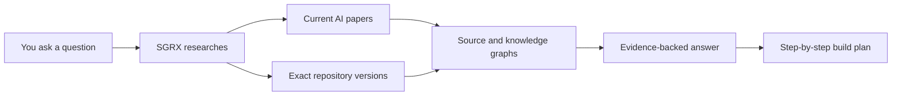

# SGRX

**Source Graph Research eXplorer**

[](https://github.com/alzenkastrati/sgrx/actions/workflows/ci.yml)
[](https://github.com/alzenkastrati/sgrx/actions/workflows/integration.yml)
[](LICENSE)

🌐 [Deutsch](README.de.md)

SGRX ships as a portable Agent Skill and a harness-neutral CLI workflow. It researches **how software should be built**, helps understand **how existing code really works**, traces dependencies, compares practices from benchmark repositories, and creates evidence-backed implementation and modernization plans. The same skill works across compatible AI agents, editor extensions, and internal developer tooling.

Ask a normal question. SGRX finds relevant AI papers and exact GitHub implementations, studies their source code, and returns a practical plan with evidence.

Current version: **0.5.0**

## What can I ask?

```text
$sgrx Research the best way to build a local voice assistant. Compare current
papers and real GitHub projects, then give me a step-by-step implementation plan.
```

```text
$sgrx Show me how the zod version in this project validates email addresses.
Trace our call into the exact library source and explain what could break.
```

### Example: understand a legacy codebase faster

Give this prompt to any AI assistant that is connected to the SGRX CLI, regardless of the harness:

```text
Use SGRX to analyze this repository in standard mode. The goal is to help a new
developer understand the codebase quickly.

Create a short Markdown report that identifies:
1. the most important modules and their responsibilities;
2. the main execution flows from entry points to business logic;
3. important external dependencies and how they are used;
4. critical or hard-to-maintain areas; and
5. the three most useful next steps for testing or modernization.

Support each finding with file and line references. Do not change the code.
```

This is useful for reducing the time needed to understand large, long-lived systems before making changes.

### Choose the right workflow

| Goal | Command |
|---|---|
| Check whether the local tools are available | `doctor` |
| Fetch an exact dependency revision | `resolve` |
| Build isolated source indexes | `index` |
| Trace application usage into dependency source | `analyze` |
| Transfer practices from a benchmark repository | `audit` |
| Compare two dependency versions | `compare` |
| Rank papers and repositories and create a build plan | `research` |
| Re-render a saved result | `report` |

Use `--dry-run` to inspect the commands and output scope without running the research tools. Use `--json` when another tool should consume the result.

## How it works



SGRX coordinates three tools:

| Tool | Simple job |
|---|---|
| **OpenSrc** | Gets the exact source-code version. |
| **Graphify** | Draws the architecture and relationships. |
| **GitNexus** | Traces functions, callers, flows, and change risks. |

This helps developers and AI assistants avoid guessing from documentation, inspecting the wrong version, or sending too much source code into the model.

## Why it can use fewer tokens

SGRX narrows the evidence **before** a model reads it:

- It ranks papers and repositories instead of analyzing every candidate.
- `quick` and `standard` modes build code-only snapshots.
- Graph queries return the relevant files, functions, and relationships—not an entire repository.
- Saved indexes and checkpoints avoid repeating completed research.
- A token budget limits how much material enters semantic analysis.

In one SGRX self-research run, the selected corpus used **5,499 Graphify input tokens** after filtering. This is an observed workflow example, not a guaranteed saving or a measurement of total model/API usage. Actual results depend on the question, repositories, and research mode.

## Install

SGRX follows the open Agent Skills format: every compatible client loads the same `skills/sgrx/SKILL.md` and bundled resources. The `agents/openai.yaml` file only adds Codex UI metadata; it is not an allow-list and other clients safely ignore it.

Skill source: https://github.com/alzenkastrati/sgrx/tree/main/skills/sgrx

### Install for all supported agents

From a cloned checkout, run the portable installer without `--target`. It installs every target:

```console
# Windows
py -3 skills/sgrx/scripts/install_skill.py

# macOS and Linux
python3 skills/sgrx/scripts/install_skill.py
```

Preview the destinations without copying anything:

```console
py -3 skills/sgrx/scripts/install_skill.py --dry-run
```

| Installation path | Agent clients |
|---|---|
| `~/.agents/skills/sgrx` | Cursor, GitHub Copilot, Gemini CLI, OpenCode, Windsurf, Amp |
| `~/.codex/skills/sgrx` | Codex |
| `~/.claude/skills/sgrx` | Claude Code |
| `~/.cline/skills/sgrx` | Cline |

Install only selected targets by repeating `--target` with `shared`, `codex`, `claude`, or `cline`. Existing installations are updated in place and unrelated skills are left untouched.

### Direct CLI use

Agents and developer tools can also call the harness-neutral CLI directly. Use `py -3` on Windows so the Microsoft Store `python` alias cannot intercept the command:

```console
# Windows
py -3 skills/sgrx/scripts/sgrx.py doctor
py -3 skills/sgrx/scripts/sgrx.py --help

# macOS and Linux
python3 skills/sgrx/scripts/sgrx.py doctor
python3 skills/sgrx/scripts/sgrx.py --help
```

Connect the CLI to the agent or developer workflow you already use, then use the prompt above as the task contract.

For example, trace how this project uses an installed npm dependency:

```console
py -3 skills/sgrx/scripts/sgrx.py analyze --registry npm --package zod --project . --question "How does this project call zod, and what implementation path handles those calls?"
```

### Audit practices from another repository

Use `audit` when the other repository is a benchmark or workflow catalog rather than an application dependency:

```console
py -3 skills/sgrx/scripts/sgrx.py audit --registry github --benchmark owner/workflow-catalog --ref 0123456789abcdef0123456789abcdef01234567 --project . --question "Which workflow and validation practices should this project adopt?"
```

Audit mode keeps benchmark and consumer indexes separate, excludes images and media by default, and stops before Graphify when its file or token budget would be exceeded. It queries lifecycle, context, distribution, validation, and reliability separately, then writes evidence mappings, a verified report, reusable checkpoints, and a compact `RUN_MANIFEST.md` handoff.

Narrow a large benchmark without raising the budget by repeating `--include-path` or `--exclude-path` with repository-relative files or directories, for example `--include-path reports --include-path development-workflows --exclude-path reports/archive`.

Audit defaults are intentionally conservative: the `code-docs` profile selects code, documents, and papers; images and media remain excluded; at most 300 files and an estimated 300,000 tokens may enter Graphify. The preflight reports `NARROW_REQUIRED` and stops before extraction when a limit is exceeded. Choose `--corpus-profile code` for source only or `--corpus-profile full` when visual and media evidence is actually required.

Each completed audit writes an isolated, resumable evidence package below `.sgrx`: resolution, corpus plan, index manifest, facet queries, index context, evidence mappings, verification results, `REPORT.md`, `RUN_MANIFEST.md`, and `events.jsonl`. Repeating the same request reuses matching indexes and query checkpoints.

## Requirements

- Python 3.10+
- Node.js 24+
- Git
- OpenSrc 0.7.3+
- Graphify 0.9.12+
- GitNexus 1.6.5+

Install the three research tools:

```console
npm install --global opensrc@0.7.3 gitnexus@1.6.5
# Windows
py -3 -m pip install graphifyy==0.9.12
# macOS and Linux
python3 -m pip install graphifyy==0.9.12
```

Check that everything is ready:

```console
# Windows
py -3 skills/sgrx/scripts/sgrx.py doctor
# macOS and Linux
python3 skills/sgrx/scripts/sgrx.py doctor
```

## What do I receive?

- A short answer to the original question.
- The papers and repository versions that were actually inspected.
- Graph-backed links between architecture, files, and functions.
- A detailed implementation plan broken into small work packages.
- Clear labels for facts, deductions, and unanswered questions.
- A visible verification status and a compact handoff manifest for continuing the run.

SGRX labels evidence as:

- `EXTRACTED` — directly supported by source code or documents.
- `INFERRED` — a reasonable conclusion, but not a proven runtime path.
- `AMBIGUOUS` — more evidence is needed.

## Safe by default

Downloaded repositories are treated as untrusted data. SGRX does not run their code, tests, builds, install scripts, or instructions. It keeps projects separate and does not modify fetched source code.

SGRX analyzes by default. It changes your application only when you explicitly ask for implementation.

## Recovery and troubleshooting

- Run the same research request again after an interruption; completed checkpoints are reused.
- Audit and analyze runs write durable resolution, corpus, index, query, evidence, verification, report, and handoff artifacts below their isolated `.sgrx` scope.
- On Windows, incomplete long-path checkouts are retried in an isolated short cache with `core.longpaths`. Global Git settings are not changed.
- Pure paper or document graphs need a supported Graphify semantic backend. Without one, SGRX reports the paper graph as `PARTIAL` instead of inventing relationships.
- On Windows, SGRX classifies GitNexus's generic missing-FTS warning as an unavailable FTS runtime path and does not rebuild an intact index. Keyword search remains visibly degraded while Graphify and symbolic GitNexus context/impact queries remain available. On other platforms, genuinely missing FTS indexes are rebuilt exactly once inside the isolated snapshot.
- Graphify zero-node files, extraction issues, and cross-chunk ID collisions are structured health failures and can no longer pass the verification gate as healthy.
- The CLI does not silently browse the web itself. Codex discovers current papers and repositories; the local CLI ranks and analyzes the recorded candidates.

## More detail

- [Research Mode](skills/sgrx/references/research-mode.md)
- [Tool routing](skills/sgrx/references/tool-routing.md)
- [Evidence model](skills/sgrx/references/evidence-model.md)
- [Output schema](skills/sgrx/references/report-schema.md)
- [Examples](skills/sgrx/references/examples.md)
- [Changelog](CHANGELOG.md)
- [Contributing](CONTRIBUTING.md)
- [Security policy](SECURITY.md)

SGRX is released under the [MIT License](LICENSE).
