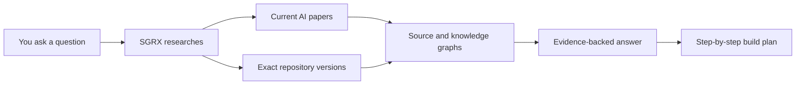

# SGRX

**Source Graph Research eXplorer**

[](https://github.com/alzenkastrati/sgrx/actions/workflows/ci.yml)
[](https://github.com/alzenkastrati/sgrx/actions/workflows/integration.yml)
[](LICENSE)

SGRX is a Codex skill that researches **how software should be built** and **how existing code really works**.

Ask a normal question. SGRX finds relevant AI papers and exact GitHub implementations, studies their source code, and returns a practical plan with evidence.

Current version: **0.4.1**

## What can I ask?

```text
$sgrx Research the best way to build a local voice assistant. Compare current
papers and real GitHub projects, then give me a step-by-step implementation plan.
```

```text
$sgrx Show me how the zod version in this project validates email addresses.
Trace our call into the exact library source and explain what could break.
```

## How it works



SGRX coordinates three tools:

| Tool | Simple job |
|---|---|
| **OpenSrc** | Gets the exact source-code version. |
| **Graphify** | Draws the architecture and relationships. |
| **GitNexus** | Traces functions, callers, flows, and change risks. |

This helps Codex avoid guessing from documentation, inspecting the wrong version, or sending too much source code into the model.

## Why it can use fewer tokens

SGRX narrows the evidence **before** Codex reads it:

- It ranks papers and repositories instead of analyzing every candidate.
- `quick` and `standard` modes build code-only snapshots.
- Graph queries return the relevant files, functions, and relationships—not an entire repository.
- Saved indexes and checkpoints avoid repeating completed research.
- A token budget limits how much material enters semantic analysis.

In one SGRX self-research run, the selected corpus used **5,499 Graphify input tokens** after filtering. This is an observed workflow example, not a guaranteed saving or a measurement of total Codex/API usage. Actual results depend on the question, repositories, and research mode.

## Install

Ask Codex:

```text
Install the skill from:
https://github.com/alzenkastrati/sgrx/tree/main/skills/sgrx
```

Then restart Codex and use `$sgrx`.

Manual installation: copy `skills/sgrx` to `$CODEX_HOME/skills/sgrx`.

## Requirements

- Python 3.10+
- Node.js 24+
- Git
- OpenSrc 0.7.3+
- Graphify 0.9.12+
- GitNexus 1.6.5+

Install the three research tools:

```console
npm install --global opensrc@0.7.3 gitnexus@1.6.5
python -m pip install graphifyy==0.9.12
```

Check that everything is ready:

```console
python skills/sgrx/scripts/sgrx.py doctor
```

## What do I receive?

- A short answer to the original question.
- The papers and repository versions that were actually inspected.
- Graph-backed links between architecture, files, and functions.
- A detailed implementation plan broken into small work packages.
- Clear labels for facts, deductions, and unanswered questions.

SGRX labels evidence as:

- `EXTRACTED` — directly supported by source code or documents.
- `INFERRED` — a reasonable conclusion, but not a proven runtime path.
- `AMBIGUOUS` — more evidence is needed.

## Safe by default

Downloaded repositories are treated as untrusted data. SGRX does not run their code, tests, builds, install scripts, or instructions. It keeps projects separate and does not modify fetched source code.

SGRX analyzes by default. It changes your application only when you explicitly ask for implementation.

## Recovery and troubleshooting

- Run the same research request again after an interruption; completed checkpoints are reused.
- On Windows, incomplete long-path checkouts are retried in an isolated short cache with `core.longpaths`. Global Git settings are not changed.
- Pure paper or document graphs need a supported Graphify semantic backend. Without one, SGRX reports the paper graph as `PARTIAL` instead of inventing relationships.
- GitNexus may report degraded keyword search when its local FTS extension is unavailable. SGRX keeps that limitation visible.
- The CLI does not silently browse the web itself. Codex discovers current papers and repositories; the local CLI ranks and analyzes the recorded candidates.

## More detail

- [Research Mode](skills/sgrx/references/research-mode.md)
- [Tool routing](skills/sgrx/references/tool-routing.md)
- [Evidence model](skills/sgrx/references/evidence-model.md)
- [Output schema](skills/sgrx/references/report-schema.md)
- [Examples](skills/sgrx/references/examples.md)
- [Changelog](CHANGELOG.md)
- [Contributing](CONTRIBUTING.md)
- [Security policy](SECURITY.md)

SGRX is released under the [MIT License](LICENSE).
